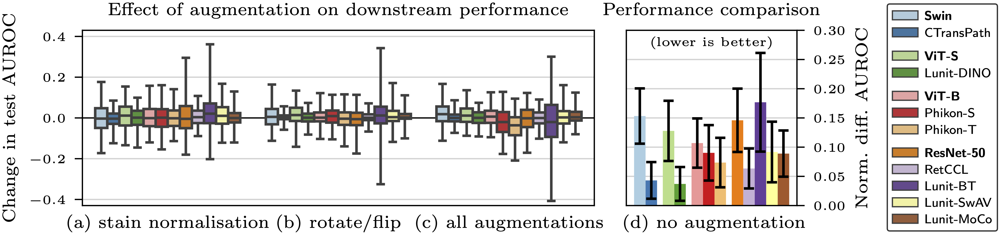
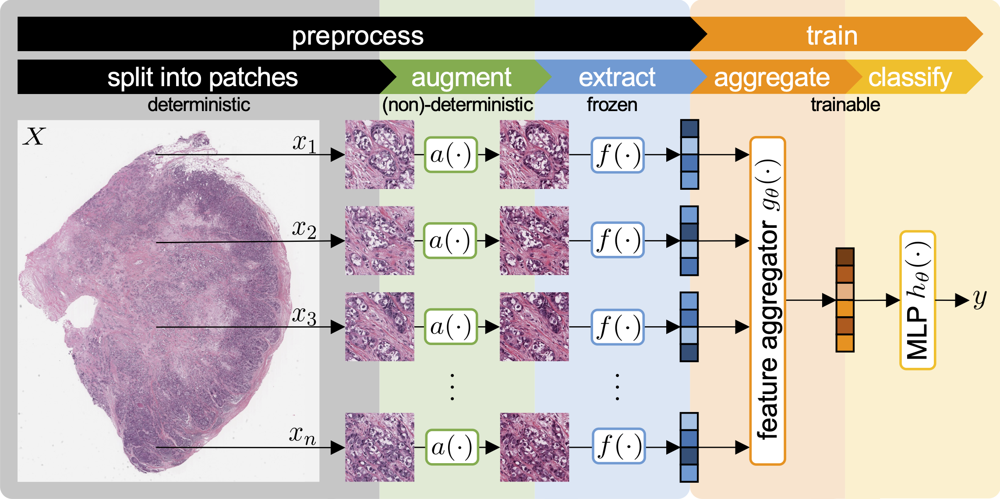

<div align="center">
<h1>A Good Feature Extractor Is All You Need</h1>
</div>

This repository contains the official code for the paper:

> [**A Good Feature Extractor Is All You Need for Weakly Supervised Learning in Histopathology**](https://arxiv.org/abs/2311.11772)  
> Georg Wölflein, Dyke Ferber, Asier Rabasco Meneghetti, Omar S. M. El Nahhas, Daniel Truhn, Zunamys I. Carrero, David J. Harrison, Ognjen Arandjelović and Jakob N. Kather  
> _arXiv_, Nov 2023.

<details>
<summary>Read full abstract.</summary>
Deep learning is revolutionising pathology, offering novel opportunities in disease prognosis and personalised treatment. Historically, stain normalisation has been a crucial preprocessing step in computational pathology pipelines, and persists into the deep learning era. Yet, with the emergence of feature extractors trained using self-supervised learning (SSL) on diverse pathology datasets, we call this practice into question. In an empirical evaluation of publicly available feature extractors, we find that omitting stain normalisation and image augmentations does not compromise downstream performance, while incurring substantial savings in memory and compute. Further, we show that the top-performing feature extractors are remarkably robust to variations in stain and augmentations like rotation in their latent space. Contrary to previous patch-level benchmarking studies, our approach emphasises clinical relevance by focusing on slide-level prediction tasks in a weakly supervised setting with external validation cohorts. This work represents the most comprehensive robustness evaluation of public pathology SSL feature extractors to date, involving more than 6,000 training runs across nine tasks, five datasets, three downstream architectures, and various preprocessing setups. Our findings stand to streamline digital pathology workflows by minimising preprocessing needs and informing the selection of feature extractors.
</details>

## Main results



- We compare 10 feature extractors, and find [CTransPath](https://github.com/Xiyue-Wang/TransPath) and [Lunit's DINO](https://github.com/lunit-io/benchmark-ssl-pathology) model produce the best representations for downstream weakly supervised slide classification tasks.
- We show that stain normalisation and image augmentations may be omitted without compromising downstream performance.

> [!NOTE]
> One of the feature extractors we evaluate in our paper is Owkin's [Phikon](https://github.com/owkin/HistoSSLscaling) model. We report results based on the "student" model, which at the time of running our experiments was recommended in their repository. However, their recommendation has since changed to use the "teacher" model instead.

## Overview


## Citing

If you find this useful, please cite:

```bibtex
@misc{wolflein2023good,
    title={A Good Feature Extractor Is All You Need for Weakly Supervised Learning in Histopathology}, 
    author    = {W\"{o}lflein, Georg and Ferber, Dyke and Meneghetti, Asier Rabasco and El Nahhas, Omar S. M. and Truhn, Daniel and Carrero, Zunamys I. and Harrison, David J. and Arandjelovi\'{c}, Ognjen and Kather, Jakob N.},
    year={2023},
    eprint={2311.11772},
    archivePrefix={arXiv},
}
```